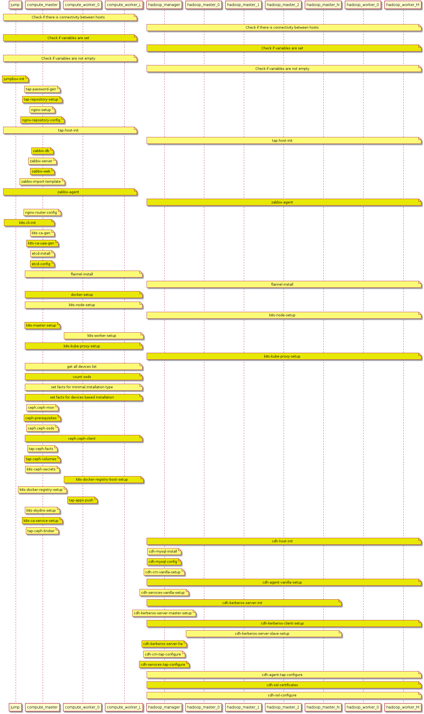
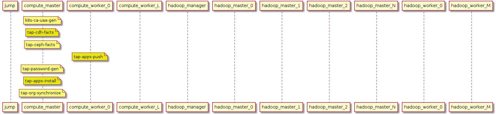
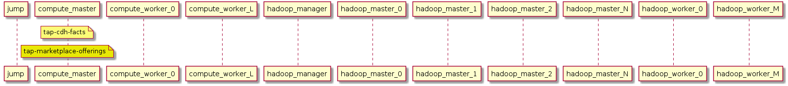

Platform Deployment Manual

Trusted Analytics Platform 0.8

>This information is intended for internal Intel use only. Relevant information will be extracted and presented in a public documentation web page for users.

# 1 Introduction

Welcome to TAP 0.8 Platform Deployment Manual.

The goal of this document is to explain TAP deployment automation and its architecture design, and how to perform essential maintenance procedures.

## 1.1 Required knowledge

While platform installation for testing purposes is easy, long-term production deployments require more in-depth knowledge of the underlying services and components.

Domain areas where administrator skills are assumed:

* Linux administration
* [Kubernetes administration](http://kubernetes.io/docs/user-guide/)
* [Docker (user-level)](https://docs.docker.com)
* [Hadoop administration](http://www.cloudera.com/documentation.html)
* [Ceph administration](http://docs.ceph.com/docs/master/)
* IP network administration

Local workstation requirements:
* Linux (clean CentOS 7.2.1511)

This document freely uses common terminology associated with those areas.

## 1.2 Deployment requirements

TAP version 0.8 supports CentOS 7.2.1511 on x86_64 architecture.

*Note:* It is best to provide machines with passwordless `sudo` access and key-based authentication.

TAP 0.8 core functionalities are based on these technologies:

* computing cluster: Kubernetes 1.3
* persistent storage: ceph 11
* hadoop cluster: CDH 5.7.1 (Cloudera Hadoop distribution)

# 2 Deployment procedure in a nutshell

TAP 0.8 has a unified installation procedure for both bare metal (hardware and operating systems provisioned by the user) and cloud deployments (TAP deployment automation creates infrastructure using APIs made available by IaaS providers).

TAP can be installed both from binary installation package or built from sources (procedure of building TAP deployment package from sources has been described below).

The deployment procedure is using 2 configuration files in yaml/json format called _Config Master File_ and _Config Master File Secrects_. Both files have to exists in TAP directory, with minimum 1 param inside.

Details on these configuration files are provided in later chapters of this manual.

TAP 0.8 deployment procedure consists of 2 phases described in detail below:
* [Infrastructure provisioning](#23-infrastructure-provisioning)
* [Platform installation](#24-platform-installation)

## 2.1 Deployment flow

Deployment is performed by Ansible playbooks.

All roles used during deployment are available in the `roles/` directory. The diagram above shows which role is executed on which machine over time during the deployment process.

Installation and configuration of all underlying technologies is being performed as presented below (diagram shows sequence of Ansible role executions on target nodes):



Then core platform components are installed and configured:



Once the deployment of the platform is completed service offerings (provided later via TAP Marketplace) are installed:



Finally, sample applications are deployed:


## 2.2 Building TAP from sources

TAP deployment package can be built from source code - for build procedure please follow [TAP building procedure](https://github.com/trustedanalytics/platform-wiki-0.8/blob/master/Platform-Deployment/platform_deployment_building_from_sources.md)

## 2.3 Infrastructure provisioning

### 2.3.1 Bare-metal

TAP 0.8 deployment procedure uses infrastructure provided by the user to install all components of the platform.

All machines provided for TAP installation **must not** be shared with other systems/platforms.

TAP deployment functionality is universal and assumes only SSH connectivity to all the hosts you want to install TAP on. While this allows you to install platform on almost any kind of physical and virtual machines, whose could be extraordinaly optimized for performance and/or reliability, by default TAP uses only generic hardware features of your hardware infrastructure.

Requirements:
- each node with `storage-worker` and `hadoop-*` roles should have mounted an additional disk or created a new partiotion if only 1 disk is available - for cloud environments disks will be created automatically based on `tap.config` file,
- all nodes should be able to connect to each other.

Provisioning steps:
1. make sure `CentOS 7.2.1511` is installed on each machine,
2. register required domain records in your domain name provider,
3. enable ssh access for the user with unlimited sudo access (via key or password) - platform will be deployed using this user,
4. run `yum update` and `yum upgrade`, otherwise delete all files from `/etc/yum.repos.d/`,
5. obtain (download or prepare yourself) TAP platform installation package `TAP-<version>-platform.tar.gz`,
6. extract this package on machine with `jumpbox` role in user's home directory (`tar -zvxf TAP-<version>-platform.tar.gz`),
7. go into your package directory (`cd ./TAP-<version>`),
8. edit `tap.config` and `tap.config.secrets` configuration files and provide necessary configuration parameters described below (it is recommended to use the most suitable template from the set provided in subdirectory `config-templates`),
9. run `./deploy.sh infra-bare-metal` and wait for completion of infrastructure configuration script (infrastructure needs to be properly configured before actual platform eployment can be perfomed).

Once the infrastructure has been successfully provisioned you can now jump to [platform installation](#24-platform-installation).

### 2.3.2 AWS

TAP 0.8 deployment automation has the functionality to provision infrastructure on AWS EC2.

The infrastructure being deployed consists of VPC, subnets, EC2 instances, ELB (Elastic Load Balancers).

AWS infrastructure provisioning automation has been done in Ansible, using [AWS module](http://docs.ansible.com/ansible/guide_aws.html). Thanks to that, we obtain proper idempotent design, where re-running automation should fix infrastructure problems.

Infrastructure provisioning deployment steps generates necessary configuration and inventory files for later use.

There are five major subnets allocated:
- one for jumpbox and nat node(nat node is only required for AWS deployments),
- two for compute resources, one for masters and one for workers (compute-* roles),
- one for Hadoop/CDH resources (hadoop-* roles),
- one for Ceph resoruces (storage-* roles).

To run AWS infrastructure provisioning you need:
- instances with CentOS 7.2,
- internet connection.

Provisioning steps:
1. obtain and extract package with TAP infrastructure provisioning scripts `TAP-<version>-infra.tar.gz` (if not available as a separate package obtain entire `TAP-<version>-platform.tar.gz`) - run `tar -zvxf TAP-<version>-infra.tar.gz` (or `TAP-<version>-platform.tar.gz` respectively),
2. edit Master Config File (`tap.config`) and Master Config File Secrets (`tap.config.secrets`) configuration files and provide necessary configuration parameters described below (it is recommended to use templates  provided in subdirectory `config-templates`),
3. go into your package directory (`cd ./TAP-<version>`),
4. run infrastructure provisioning script `./deploy.sh infra-aws`,
5. register required domain records in your domain name provider,
6. connect to your newly created jumpbox host - type `./connect`,
7. obtain (download or prepare yourself) and extract TAP platform installation package `TAP-<version>-platform.tar.gz` on machine/node with `jumpbox` role in user's (`centos`) home directory - run `tar -zvxf TAP-<version>-platform.tar.gz`.

Once the infrastructure has been successfully provisioned you can now jump to [platform installation](#24-platform-installation).

#### 2.3.2.1 AWS domain registration

Below you will find a sequence of operations needed to register your AWS-hosted TAP cluster in AWS DNS:
1. login into AWS console,
2. go to VPC page and enter VPC name (env_name parameter in `tap.config`) there,
3. go to EC2 page and then to Load Balancer page (available via vertical UI menu),
4. then, select your load balancer from the list (you can use *Filter* search panel to filter out the right VPC) and copy to clipboard its DNS name (without *(A Record)* string),
5. go to Route53 page and select *Hosted zones*,
6. create new or edit existing record set - *Name* should be `*.<subdomain>.<domain>` (`<subdomain>.<domain>` is your `tap_domain_name` parameter from `tap.config` file), *Type* should equal to CNAME, and as *Value* paste DNS name from load balancer,
7. save your record.

*Note:* For more information on load balancers and DNS please refer to the below chapter named TAP Load Balancing.

## 2.4 Platform installation

Please verify on the jmpbox host if the following configuration files are available:
* `$HOME/tap-configuration/tap.config` (Master Config File you have defined earlier on your machine)
* `$HOME/tap-configuration/tap.config.secrets` (Master Config File Secrets you have defined earlier on your machine)
* `$HOME/tap-configuration/tap.inventory.out` (file with TAP cluster inventory automatically generated during infrastructure provissioning)
* `$HOME/tap-configuration/tap.instance.out` (file with addresses of TAP cluster load balancer(s) to be registered in your DNS operator)

Having properly provisioned and configured infrastructure (scripts described above completed execution without errors) you can run actual platform installation script:

`./deploy.sh deploy`.

* Properly installed TAP 0.8 can be accessed via web console available under address: http://console.(your-domain-name) where _(your-domain-name)_ is the domain name you have provided in Master Config File (parameter 'wildcard_tap_domain_name' - see details below).

**Notes:**
* Your installations logs are stored in your TAP platform installation package directory, in subfolder `logs`.
* Deployment scripts internally use Ansible (`>=2.2.1.0`), following its idempotent nature. This means you can run `./deploy.sh` deploy over and over again, and only changes will be applied.
* This feature can be used to repair broken host with TAP 0.8 only.
* Automatic cluster size extension, shrinking or node role change are not yet supported in TAP 0.8.*.

**Idempotency**

"The concept that change commands should only be applied when they need to be applied, and that it is better to describe the desired state of a system than the process of how to get to that state. As an analogy, the path from North Carolina in the United States to California involves driving a very long way West but if I were instead in Anchorage, Alaska, driving a long way west is no longer the right way to get to California. Ansible’s Resources like you to say “put me in California” and then decide how to get there. If you were already in California, nothing needs to happen, and it will let you know it didn’t need to change anything."

Definition taken from [ansible documentation](http://docs.ansible.com/ansible/glossary.html).

# 3 Deployment Configuration - Master Config File

---

To provide a single configuration point for the entire, quite complex platform, TAP deployment scripts use tap.config file  described in this section.

During the deployment process other configuration files are being generated automatically (like Ansible inventory file and group var files for various subsystems).

By default the master configuration file is named `tap.config`

The default file name can be overriden by environment variable `CONFIG`

This file contains global variables overrided in all ansible playbooks and tasks and instance definitions.

Default file format:
`<param name>: <param value>`

Template configuration files with various TAP hardware setups are provided in deployment package in subdirectory `config-templates`.

## 3.1 Sample tap.config file

```
tap_domain_name: "example.com"
smtp_host: 127.0.0.1
smtp_password: password
smtp_port: 25
smtp_protocol: smtp
smtp_username: username
    kerberos_enabled: true
    installed_platform_offerings:
      - couchdb16
      - redis30
      - postgresql93
      - rabbitmq36
      - memcached14
      - influxdb088
      - cassandra21
      - jupyter
      - mosquitto14
      - gateway
      - mysql56
      - mongodb30
      - hive
      - hdfs
      - zookeeper
      - orientdb
instances:
  compute-master:
    connection:
      type: ssh-key
    roles:
    - compute-master
    - storage-master
    - storage-worker
    storage:
      system-partition-size: 400
      devices:
      - size: 300
        device: "/dev/xvdb"
    type: largex2
    user: centos
  compute-worker-0:
    connection:
      type: ssh-key
    roles:
    - compute-worker
    type: largex
    user: centos
  compute-worker-1:
    connection:
      type: ssh-key
    roles:
    - compute-worker
    type: largex
    user: centos
  hadoop-manager:
    connection:
      type: ssh-key
    roles:
    - hadoop-master-controller
    storage:
      devices:
      - device: "/dev/xvdb"
    type: largex2
    user: centos
  hadoop-master-0:
    connection:
      type: ssh-key
    roles:
    - hadoop-master-primary
    storage:
      devices:
      - device: "/dev/xvdb"
    type: largex
    user: centos
  hadoop-master-1:
    connection:
      type: ssh-key
    roles:
    - hadoop-master-secondary
    storage:
      devices:
      - device: "/dev/xvdb"
    type: largex
    user: centos
  hadoop-worker-0:
    connection:
      type: ssh-key
    roles:
    - hadoop-worker
    storage:
      devices:
      - device: "/dev/xvdb"
    type: largex
    user: centos
  hadoop-worker-1:
    connection:
      type: ssh-key
    roles:
    - hadoop-worker
    storage:
      devices:
      - device: "/dev/xvdb"
      - device: "/dev/xvdc"
      - device: "/dev/xvdd"
    type: largex
    user: centos
  jump-instance:
    connection:
      type: local
    roles:
    - jumpbox
    type: t2.medium
    user: centos
```

## 3.2 Master Config File - Parameters

Note: For updates and/or further details please refer to [tap-deploy git repository](https://github.com/trustedanalytics/tap-deploy/).

### 3.2.1 Required Core Parameters

---

###### ntp_servers

List of ntp servers used in deployment.

Default: `['0.pool.ntp.org', '1.pool.ntp.org']`

---

###### tap_domain_name

Domain for your TAP cluster applications. Record for `*.<tap_domain_name>` should be registered, and should target your load balancer or instance with `compute-master` role.

Default: `<compute-master IP>.xip.gotapaas.eu`

---

###### deployment_type

CDH-related parameter. This option determines the amount of resources allocated for each Hadoop service and process.

Configuration types:
- minimal - environment with minimal performance and resources needed (HA not possible - forced disabled)
- standard - production environment (HA possible)

Default: `standard`

---

###### smtp_host

SMTP host address.

---

###### smtp_port

SMTP port.

---

###### smtp_protocol

SMTP protocol.

---

###### smtp_username

SMTP username.

*Note:* It is strongly recommended to store this parameter in `tap.config.secrets` file.

---

###### smtp_password

SMTP user password.

*Note:* It is strongly recommended to store this parameter in `tap.config.secrets` file.

---

###### platform_admin_password

Password to be used by TAP Platform administrator to log in into TAP Console and API.

*Note:* It is strongly recommended to store this parameter in `tap.config.secrets` file (please see chapter on Master Config File Secrets).

---

###### cdh_admin_password

CDH admin password (please comply to password requirements imposed by CDH).

*Note:* It is strongly recommended to store this parameter in `tap.config.secrets` file.

---

###### instances

Defines machines/nodes to be used during TAP deployment.

Example:
```
instances:
  cdh:
    ip: 54.145.177.163
    user: centos
    type: largex
    connection:
      type: ssh-key
    storage:
      system-partition-size: 100
      devices: [{"device":"/dev/sdb"},{"device":"/dev/sdc"}]
    roles:
      - hadoop-master-controller
      - hadoop-worker
      - hadoop-master-primary
  k8s:
    ip: 54.145.177.165
    user: centos
    type: largex
    connection:
      type: local
    storage:
      system-partition-size: 100
      devices:
        - device: '/dev/sda2'
          size: 500
    roles:
      - compute-master
      - compute-worker
      - storage-master
      - storage-worker
      - jumpbox
```

**machine name**

Machine/instance name is its key in this map (in above example: `cdh` and `compute`). The name has to be unique, otherwise only last defined item with this name is used in deployment.

Machines defined herein will be later available in TAP cluser under `<name>.instance.<wildcard_tap_domain_name>` and `<name>` dns names.

**machine parameters**

---

- **ip**

	Required for bare-metal installation only (points to machine that will be used for TAP deployment).

- **user**

	Optional for all installations, by default `centos`.

	Such user will be used to connect it via ssh - no pass sudo should be enabled for this user.

- **type**

	Required for all cloud installations.

	Instance/machine sizes/types defined in TAP (section Instance sizes), but also cloud instance size names provided by cloud provider can be used here.

	Please refer to Master Config File templates for recommended setups.

- **connection**

	Connection parameters used to connect to instance/machine.

	For param `type` you can use several values:
	- `local` - have to be used for role `jumpbox`
	- `ssh-key` - connection using key without password while connecting to instance
	- `ssh-pass` - connection using password while connecting to instance (not supported yet)
	- `ssh-key-pass` - connection using key with password while connecting to instance (not supported yet)

	Other supported params:

	- `key` - by default `~/.ssh/id_rsa`. Key file location (not supported yet)

- **storage**

	Storage definitions used by roles. You can specify here which devices should be managed (and created in cloud) in deployment (see earlier section on 'Persistent storage allocation').

	Params:

	- `system-partition-size` - optional, by default 100. Root disks size mounted under `/`, ignored on `bare-metal` installation.
	- `devices` - device list (yaml syntax, ie. `devices: [{"device":"/dev/sdb"},{"device":"/dev/sdc"}]`), minimum 1 device required for roles `storage-worker` and `hadoop-*`. For each device you have to define how this device will be visible in system, for example `/dev/sdb1`. Size param is optional (default value: 200) and used only in cloud installations.

	In AWS you have to use specific device names. Device name should match `/dev/xvd<nr>`, where `<nr>` it is next device number, starting from `b`:
	Example:

	```
	/dev/xvdb
	/dev/xvdc
	```

- **roles**

	Defines functional roles assigned for this machine (see below chapter on 'Supported Machine Roles').

### 3.2.2 Required Parameters for AWS Deployment

---

###### aws_access_key

AWS access key.

*Note:* It is strongly recommended to store this parameter in `tap.config.secrets` file (please see chapter on Master Config File - Secrets).

---

###### aws_secret_key

AWS secret key.

*Note:* It is strongly recommended to store this parameter in `tap.config.secrets` file (please see chapter on Master Config File - Secrets).

---

###### aws_region

AWS region. More info you can find on [AWS page](http://docs.aws.amazon.com/AWSEC2/latest/UserGuide/using-regions-availability-zones.html#concepts-available-regions)

---

###### aws_availability_zone

AWS availability zone. More info you can find on [AWS page](http://docs.aws.amazon.com/AWSEC2/latest/UserGuide/using-regions-availability-zones.html#using-regions-availability-zones-describe)

---

###### aws_base_resource_tags

Tags for each resource created in AWS. Use only strings in quotes.

Example:
```
aws_base_resource_tags:
  project: "TAP"
  owner: "root"
```

---

###### aws_jumpbox_key_name

Name of a key that is to be used (or automatically created, if does not exist) by AWS during deployment provisioning.

This key will be then used to access jumpbox machine in TAP cluster.

Default: `<env_name>-jumpbox-key`

---

###### aws_cluster_key_name

Name of a key that is to be used (or automatically created, if does not exist) by AWS during deployment provisioning.

This key will be then used to access any machine in TAP cluster other than jumbox.

Default: `<env_name>-cluster-key`

---

###### env_name

Name of TAP instance (used as VPC name, cluster name, etc.).

Characters allowed:
- a-z
- _ (not as first character)
- 0-9 (not as first character)

---

### 3.2.3 Optional Core Parameters

---

###### http_proxy

Address of HTTP proxy if it is necessary to access external resources during deployment (like additional software packages, libraries, etc.) and later platform operations.

---

###### https_proxy

Address of HTTPS proxy if it is necessary to access external resources during deployment (like additional software packages, libraries, etc.) and later platform operations.

---

###### no_proxy

List of addresses/domains that shall not be proxied.

---

###### enable_external_ssl

This parameter defines if TAP is available via HTTP or HTTPS.

Prossible values:
- true (default, TAP available only via HTTPS)
- false

---

###### hdfs_ha_enabled

Determines if HA on HDFS is enabled.

This config option requires at least 3 nodes with installed `hadoop-master*` roles: `hadoop-master-primary`, `hadoop-master-secondary`, `hadoop-master-controller`.

Possible values:
- true (default)
- false

This configuration option is set to False when `deployment_type` is set to `minimal`.

---

###### yarn_ha_enabled

Determines if HA on YARN is enabled. This config option requires at least 2 nodes with installed `hadoop-master*` roles: `hadoop-master-primary`, `hadoop-master-secondary`.

Possible values:
- true (default)
- false

This configuration options is set to False when `deployment_type` is set to `minimal`.

---

###### platform_ssl_private_base64

Private key (base64 encoded) for TAP domain name provided via parameter `*.<tap_domain_name>`.

Generated automatically if not provided by the user.

---

###### platform_ssl_cert_base64

Certificate (base64 encoded) for TAP domain name provided via parameter `*.<tap_domain_name>`.

Generated automatically if not provided by the user.

*Note:* Automatically generated certificate it *not trusted*.

---

###### berberos_enabled

Determines if Kerberos-based security is enforced accross Hadoop cluster.

Available values:
- true
- false

Default value: true

---

### 3.2.4 Supported Machine Roles

This section describes functional roles that are to be assigned to TAP cluster machines.

Key functionalities of TAP platform have been groupped in sets named 'roles' that can be assigned to cluster machines/nodes.

Roles are required parameters of each instance (meaning machine or node) defined in Master Config File described in the chapters above.

Roles `compute-*` and `storage-*` cannot be combined with `hadoop-*` roles on the same machine.

---

#### 3.2.4.1 Role _compute-master_

Installed services:
- Kubernetes master
- TAP CA certificate management
- TAP password management
- etcd server
- TAP ceph broker

**Note:** 1 instance if this role is required.

---

#### 3.2.4.2 Role _compute-worker_

Machines with 'compute-worker' role assigned are used as compute instances for kubernetes.

Installed services:
- Kubernetes worker
- bootstrap docker registry

**Note:** Minimum 1 instance required. For minimal TAP installation can be combined with `compute-master` role.

---

#### 3.2.4.3 Role _hadoop-master-controller_

Core role for CDH cluster.

Installed services:
- CDH manager
- CDH monitoring services
- CDH master services
- CDH single instances
- kerberos server
- mysql for CDH

**Note:** 1 instance if this role is required.

---

#### 3.2.4.4 Role _hadoop-master-primary_

Installed services:
- CDH master services
- HDFS namenode, YARN resource manager

**Note:** 1 instance if this role is required. In minimal TAP installation combined with `hadoop-master-controller` role.

---

#### 3.2.4.5 Role _hadoop-master-secondary_

Installed services:
- CDH master services
- HDFS Secondary NameNode, YARN Resource Manager

**Note:** No more than 1 instance. Required only when HA for YARN or HDFS is enabled.
**Note:** Cannot be combined with `hadoop-master-primary` or `hadoop-master-controller` roles.

---

#### 3.2.4.6 Role _hadoop-master_

Installed services:
- CDH master services (Kafka, ZooKeeper)

**Note:** Optional role. Used to provide zookeeper and kafka with additional computing resources.

---

#### 3.2.4.7 Role _hadoop-worker_

Installed services:
- CDH worker services (HDFS DataNode, YARN Node Manager, HBase)

**Note:** At least 1 instance required.

In minimum TAP installation combined with `hadoop-master-controller` role. This role determines resources available for HDFS, YARN and HBase.

Optimal production-grade configurations contain odd number of machines with this role (2N + 1).

---

#### 3.2.4.8 Role _storage-master_

Role used for provisioning TAP with persistent storage services.

Installed services:
- Ceph mons

**Note:** At least 1 instance required.

In minimum TAP installation combined with `compute-master` role.

For production environments at least 3 instances recommended that shall be separated from `compute-*` roles.

---

#### 3.2.4.9 Role _storage-worker_

Installed services:
- Ceph osds

**Note:** At least 1 instance required.

For minimum TAP installation combined with `compute-master` role.

For production environments minimum 3 instances recommended that shall be separated from `compute-*` roles.

Optimal production-grade configurations contain odd number of machines with this role (2N + 1).

---

#### 3.2.4.10 Role _storage-client_

Installed services:
- Ceph client

This role should be installed on all machines that need access to persistent storage service provided by Ceph.

**Note:** Automatically installed (no need to be added manually) on machines with roles:
- `compute-master`
- `compute-worker`

---

#### 3.2.4.11 Role _jumpbox_

Hardened bastion host dedicated to protecting TAP installation from external attacks. It is recommended to be the only machine in TAP cluster exposed to external network. Refer to [WiKi page on bastion hosts](https://en.wikipedia.org/wiki/Bastion_host) for more details.

In minimum TAP installation will share machine with `compute-master` role but it is strongly recommended to create/use separated machine for this role.

This role requires only 1 CPU and 2 GB RAM.

---

#### 3.2.4.12 Role _platform-monitor_

Role allows remote monitoring of availability and performance of TAP cluster components. [Zabbix](http://http://www.zabbix.com/product) is being used for this purpose.

**Notes:** 
- This role can be selected no more than once.
- Can run on any of `compute-*` nodes (it is recommeded to select it on a machine with `compute-master` role).
- Once the role is selected zabbix-agents will be installed on all machines in the TAP cluster.

---

## 3.3 Deployment Configuration - Master Config File Secrets

It is suggested not to keep any passwords and sensitive data in Master Config File as this file also describes platform configuration and can be potentially shared with external parties (ie. providers of maintenance/support services, during troubleshooting, etc.).

Such secret secret data shall be stored in a separate (never shared) file named `tap.config.secrets` - it is used together with Master Config File during deployment (joined in runtime).

The default file name can be overriden by environment variable `SECRETS`.

In the future `tap.config.secrets` can be also encrypted using `ansible-vault` (not yet supported in TAP 0.8).

**Note:** This file must not be empty - at least one parameter is needed!

## 3.4 Deployment Configuration - Persistent storage allocation

All machines defined in the Master Config File should define persistent storage they will be allocating for use.

Persistent storage is used by TAP itself, TAP-hosted services, and Hadoop, depending on the functional role of a given machine.

TAP uses attached storage allocation approach.

Attached storage allocation is used whenever storage is provided as OS-visible storage devices that can be exclusively allocated for TAP persistent storage.

Such allocation is recommended also in bare-metal installations: the OS resides on one storage device (should not be smaller than 100GB) while the other available storage devices (physical or virtual discs) can be exclusively allocated for TAP persistent storage.

To attach a persistent storage in this mode the following attribute (part of machine description) must be used:

```
     storage:
            devices: *
```

Such parameters allow allocation for TAP persistent storage of all available unused (unattached) storage devices.

Alternatively, the user can provide a list of named devices to be used for this purpose, such as:
```
     storage:
           devices:
               - device: '/dev/hdd2'
               - device: /dev/hdd3
               - device: /dev/hdd4
               - device: /dev/hdd5
```

TAP 0.8 uses Ceph RADOS Block Device (RBD) to provide reliable, persistent, and distributed network attached storage for containers data storage.

When assigning roles to machines, ensure your follow either official guidance from the [Ceph project](http://docs.ceph.com/docs/master/start/hardware-recommendations/) or follow TAP configuration recommendations.

In general, you should use a dedicated disk drive on each Ceph storage node.

**Warning:** All storage devices allocated for TAP will be formated during platform installation so any existing data will be irrevocably lost!

**Note:** This storage allocation mode *does not create* any storage when the deployment is done in the cloud; it just attaches storage devices already made available for TAP.

# 4 Reference Configurations

## 4.1 Minimum configuration

This configuration is recommended for trying out TAP and its analytics features.

* The suggested Minimum Configuration layout consist of 2 nodes (hosts) only:
      - 1 node (computation machine):
         * compute-master (in TAP 0.8: kubernetes master)
         * storage-master (in TAP 0.8: ceph master)
         * compute-worker (in TAP 0.8: kubernetes worker)
         * storage-worker (in TAP 0.8: ceph worker)
         * jumpbox
      - 1 node (hadoop machine):
         * hadoop-master-primary (in TAP 0.8: CDH Master Primary)
         * hadoop-master-controller (in TAP 0.8: CDH Manager)
         * hadoop-worker (in TAP 0.8: CDH Worker)

* Hardware requirements for each node:
     * 24 GB of RAM
     * 4 CPU cores
     * 100 GB of HDD for root directory
     * at least one storage device (200 GB) avaliable for mount if role `hadoop-*` or `storage-master` is installed on the node

**Note:** If storage device is not explicitly provided then the master/root drive will be used for storage!

**Note:** The minimal configuration does *not* provide important reliability features that are required for production deployments.

## 4.2 Medium configuration

Characteristics of this configuration:

* Redundant functions are distributed among separate nodes to provide high availability and data replication

* *Not* focused on raw platform performance, rather on cluster reliability

* Suggested Medium Configuration layout consist of 8 nodes (hosts, HA disabled):
      - 1 node:
         * compute-master (in TAP 0.8: kubernetes master)
         * storage-master (in TAP 0.8: ceph master)
         * jumpbox
      - 3 nodes:
         * compute-worker (in TAP 0.8: kubernetes workers)
         * storage-worker (in TAP 0.8: ceph workers)
      - 1 node (it has to be bigger, 32GB RAM):
         * hadoop-master-primary (in TAP 0.8: CDH Master Primary)
         * hadoop-master-controller (in TAP 0.8: CDH Manager)
      - 3 nodes:
         * hadoop-worker (in TAP 0.8: CDH Workers)

* Hardware requirements for each node:
     * 16 GB of RAM
     * 4 CPU cores
     * 100 GB of HDD
     * at least one storage device (200 GB) avaliable for mount if role `hadoop-*` or `storage-master` is installed on the node

**Note:** If storage device is not explicitly provided then the master/root drive will be used for storage!

## 4.3 Production grade configuration

Characteristics of this configuration:
* Redundant functions are distributed among separate nodes to provide performance, high availability (HA) and replication

* Suggested layout consist of 16+ nodes (hosts):
      - 1 node (medium instance, 2CPU + 4GB of RAM):
         * jumpbox
      - 3 nodes (large instance - 2CPU + 8GB of RAM for 10> workers, largex instance - 4CPU + 16GB of RAM for 30> workers, largex2 or even more for bigger clusters):
         * compute-master (in TAP 0.8: kubernetes master)
      - 3+ nodes (large instance, 4 CPU + 16GB of RAM - these nodes provide the real computational power of the cluster):
         * compute-worker (in TAP 0.8: kubernetes workers)
      - 3 nodes (medium instance - 2CPU + 4GB of RAM):
         * storage-master (in TAP 0.8: ceph master)
         * storage-worker (in TAP 0.8: ceph workers)
      - 0+ nodes (small instance - 2CPU + 2GB of RAM):
         * storage-worker (in TAP 0.8: ceph workers)
      - 1 node (largex instance - 4CPU + 16GB of RAM):
         * hadoop-master-primary (in TAP 0.8: CDH Master Primary)
      - 1 node (largex instance - 4CPU + 16GB of RAM):
         * hadoop-master-secondary (in TAP 0.8: CDH Master Primary)
      - 1 host (largex2 instance - 8CPU + 32GB of RAM):
         * hadoop-master-controller (in TAP 0.8: CDH Manager)
      - 3+ hosts (at least large instance - 4CPU + 16GB of RAM - these nodes provide the real power of YARN in Hadoop cluster):
         * hadoop-worker (in TAP 0.8: CDH Worker)

* In this setup persistent storage is installed on dedicated nodes (roles: storage-master and storage-worker). You should follow [Ceph documentation](http://docs.ceph.com/docs/jewel/start/hardware-recommendations/) on recommended hardware setups.

#### Supplement: recommendations for persistent storage service (storage-* nodes)

Ceph, that in TAP 0.8 provides persistent storage service, needs to run 2 daemons - ceph-mon and ceph-osd; good practice is to have minimum 3 ceph-mon and 3 ceph-osd.

It is strongly recommended to allocate for Ceph-OSD (machine role: 'storage-worker') at least 1GB RAM per 1TB storage, 1 storage drive per deamon (SSD - better performance/higher cost, HDD lower performance/lower cost) and 20GB root HDD.

For Ceph-MON (machine role: 'storage-master') at least 1GB RAM and 20GB on root HDD should be allocated.

# 5 TAP Architecture & Core Components

## 5.1 TAP Load Balancing

TAP manages load balancers for the platform in order to:

* improve bastion host security, as load balancer machines have stripped and hardened configuration,
* provide transparent TLS functionality,
* provide scaling functionality, where single application URL can be redirected to multiple application instances.

### 5.1.1 Load Balancers architecture


      ***************
      |   Internet  |
      ***************
             /\
             ||
     ******* || ********* TAP BELOW ********** TAP BELOW ********** TAP BELOW ***********
             ||
             \/                                            |--- application1, instance 1
     __________________       ________________________     |
    |   Primary LB     |     | Ingress Load Balancers |    |--- application1, instance 2
    | (nginx TCP mode) | <=> | nginx HTTPS mode       | -- |
    |__________________|     |________________________|    |--- application2, instance 1
                                                           |
                                                           |--- service1, instance 1
                                                           |--- core-component, instance 1
                                                           |--- .....


### 5.1.2 Primary Load Balancers

This group represents dedicated hosts (physical, VMs) directly accessible from the Internet. The package selection on those is minimal. Hardened packages are installed where possible.

The primary applications installed here are:
* Firewall (iptables) - to block unnecessary traffic and allow administrators to cut traffic on the network level
* Load Balancer application - Nginx
   * Nginx is configured to redirect all traffic on ports 80 and 443 to the Ingress Load Balancers machine group.

### 5.1.3 Ingress Load Balancers

This group represents Pods running on Kubernetes, hosting Nginx load balancer dynamically reconfigured by management components hosted on the same host.

Mode of operation:
* Periodically get all the "Ingress" objects from Kubernetes.
* For each "Ingress" object - lookup relevant "Service" objects.
* Generate Nginx configuration file using those objects.
* Reload Nginx in graceful, no downtime, mode.

With proper generated Nginx configuration files, traffic is distributed to targeted applications, services and components based on the "Host" header in HTTP(S) requests.

* Please note that the TLS certificate passed in Ingress objects are supported in TAP 0.8 (ones over which session key shall be negotiation with the Client from the Internet).
* Please note that "Endpoint" Kubernetes objects, when backed up with proper "Service" and "Ingress" objects, are supported in TAP 0.8.
* Please note that Ingress Load Balancers hosts are pre-loaded with TAP CA certificate and should access internal services over HTTPS.

### 5.1.4 DNS and entry router configuration with multiple Load Balancers

In setups with multiple Primary Load Balancer hosts the administrator shall configure:

* When using AWS EC2 Elastic Load Balancer (ELB):
   * Ensure that traffic is directed to all the machines in a round-robin fashion.
   * Ensure that the wildcard TAP domain name points to the ELB CNAME DNS records.
* When using company-internal router / load balancer:
   * Ensure that traffic is directed to all the machines in a round-robin fashion.
   * Ensure that the wildcard TAP domain name points to the proper endpoint of the company-internal router / load balancer.
* When DNS-based load distribution is expected:
   * Ensure that all Primary Load Balancer hosts have their entry under the wildcard TAP domain name DNS entry.

## 5.2 Transport Level Security (TLS) in TAP

To ensure that the entire traffic inside TAP cluster is protected by TLS, TAP provides its own Certificate Authority (CA) components. This component is used by all components to generate keys and certificates necessary for platform operation.

### 5.2.1 Implementation

CA Service uses [CFSSL](https://github.com/cloudflare/cfssl) to generate and manage local Certification Authority. It is exposed via a simplified REST API (a custom one, as cfssl exposes too much functionality).

To every Kubernetes Pod the platform starts (one exposing some functionality over integrated HTTP server) we add an additional container - with nginx. This Nginx is generated over a CA Service API key and certificate. It is proxying exposed port :443  to 127.0.0.1:80 in the same Pod (targetting an actual application).

To allow other services and applications to connect to the ones secured with platform's CA, we mount an additional secret as a volume to each Pod. This secret contains CA certificates (in popular formats) used by the platform. This certificate is used by default for all applications.

### 5.2.2 Architecture Diagram

The following diagram describes how certificates and keys are attached to the Pods:

[[img/ca.png]]

Lifecycle of the TLS-related Kubernetes Secrets objects:

[[img/ca2.png]]

## 5.3 Network connectivity inside TAP

All compute nodes and Hadoop nodes, as well as containers running on TAP, are interconnected using [Flannel](https://github.com/coreos/flannel).

This allows every container instance (specifically: Kubernetes Pod) to get its own IP address and full connectivity to other hosts and pods in the TAP environment (assuming  it is supporting only a single organization).

**DNS - SkyDNS**

TAP uses SkyDNS with a Kubernetes plug-in to provide internal domain names for every Kubernetes service. Some DNS records are created during the deployment process for Cloudera Hosts (CDH require such DNS entries).

The Kubernetes SkyDNS integration works by polling the list of “Service” objects and adjusting DNS entries automatically. The important aspect of this is that the SkyDNS cluster IP is by default added to `/etc/resolv.conf` on each container Kubelet starts (so it should work out of the box with everything which is dynamically linked with `glibc`).

## 5.4 Logs aggregation - ELK stack

All TAP hosts are configured to push their logs (via SystemD) to the ElasticSearch stack (ElasticSearch, Logstash, Kibana).

In addition, a Kubernetes addon is deployed. Because to this addon, all containers also push their stdout and stderr to the ELK instance.

You can deploy more than one ELK instance - they will form a cluster. At least 3 nodes are recommended for production-class TAP installations.

## 5.5 Container images - docker registry

Most of the TAP components are being shipped as Docker Container Images. In order to save disk space and network bandwidth, there is a whole [Docker Registry v2](https://github.com/docker/distribution) data directory distributed inside TAP package.

During platform installation:

1. dedicated Docker Registry v2 is started, backed by empty persistent storage,
2. temporary Docker Registry v2 is started, with a data directory mounted from the unpacked TAP package,
3. images are pushed from the temporary Registry to the permanent one.

Using this approach, update packages can easily be distributed, which will contain only new versions of *some* images.

**Note:** This update approach is not yet supported in TAP 0.8.

## 5.6 HA for docker registry

There are two endpoints for docker registry: one is read-write, the second one is read-only.

Since the Docker Registry is backed by a Ceph storage and only a single instance can have a volume mounted in read/write mode, additional instances mount this volume in read-only mode.

**Note:** minio may also be used as a registry backend.

## 5.7 Extending deployment automation

To extend installation automation with your custom services that are not managed by TAP Platform itself, you simply have to follow general Ansible guidelines.

Create a new Role in the `roles` directory and include it in the `platform.yml` file that defines the sequence of infrastructure provisioning operations (like Kubernetes installation).

You can either reuse existing machine group to assign the newly created role to it, or create a new machine group for this purpose (in such case the automation of inventory generation should be updated too).

# 6 Troubleshooting

## 6.1 Deployment troubleshooting

As with any complex system, both expected failures (e.g., network connectivity) and unexpected failures may appear. This section should prepare you to handle and debug those.

## 6.2 General problem investigation procedure

Make sure the target machine is in an overall good shape:
1. Check available disk storage using `df -h`. Machines without free disk space will experience issues in many different areas.
2. Check available memory using `free -m`. Machines without memory will invoke OOM Killer, which will terminate processes.
3. Ensure that machines have at least 1GB of memory free (or allocated as buffers/cache)
4. Check machine load, using uptime, top, or ps auxf. Machines under very high load can drop packages, timeouts may appear. Machine load should not exceed 70% in healthy, responsive clusters.
5. Check logs:
   * Modern Linux distributions use Systemd. Use `sudo systemctl` and `sudo journalctl` to view services and logs for the machine. For *systemd* reference, refer to [documentation](https://wiki.archlinux.org/index.php/Systemd).
   * Some older components still use `/var/log/` directory to store logs.
   * The package integrates an ELK stack, which can be used to browse logs across all nodes, applications, and containers.
6. Check metrics:
   * Using either TAP web console, or
   * Grafana integrated with TAP. It is available via [https://grafana.${PLATFORM_DNS_NAME}]
7. On Kubernetes nodes:
   * Check pods health, using ``sudo -u tap-admin kubectl get pods`. If everything is in a "Running" state, the pods are healthy. If not, check unhealthy pods logs using `sudo -u tap-admin kubectl logs $POD_ID`, and for overall status `sudo -u tap-admin kubectl describe $POD_ID`.

### 6.2.1 Deployment investigation data

When troubleshooting, in addition to information gathered in *General problem investigation* section above, make sure the following files are available:
* `$HOME/tap-configuration/tap.config` (Master Config File you have defined earlier on your machine)
* `$HOME/tap-configuration/tap.config.secrets` (Master Config File Secrets you have defined earlier on your machine)
* `$HOME/tap-configuration/tap.inventory.out` (file with TAP cluster inventory automatically generated during infrastructure provissioning)
* `$HOME/tap-configuration/tap.instance.out` (file with addresses of TAP cluster load balancer(s) to be registered in your DNS operator)
* `<tap-installation-package-dir>/logs/*.log`

**Note:** Some configurations files and log files may contain sensitive information, like user credentials.


