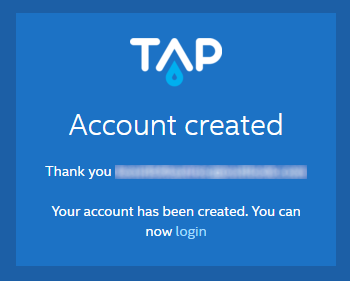

This page shows you how to respond to an initial TAP platform invitation and an initial invitation to an organization/space. It also covers ongoing TAP login.

# Initial user access to platform

Initial access to the *platform*, along with the request to create an organization, is available only by invitation from a system admin. Contact your system admin for this type of platform invitation. (See the next topic for the other type of invite, which does *not* include the request to create an organization.)

After receiving a TAP invitation email from the admin, click on the link inside the email. This lands you on the registration page shown below, where you specify your TAP password and create/name an organization.

Enter your password choice (twice) and the name you choose for your organization, select the Terms of Service checkbox, and click **Create account**. 

TAP creates a platform  account with your email address as a login name. TAP also creates an organization associated with your account, with a default space under the organization (named `default`).

TAP then displays a confirmation screen (shown below). Click on the login link in the confirmation screen to log into the platform. (Remember to save the login link for future use.)

For more information about organizations and spaces, [go here](https://docs.cloudfoundry.org/concepts/roles.html) (Cloud Foundry page).

# Responding to an initial organization/space invite

If you are *not* a member of the platform yet, an organization/space owner can invite you to an existing organization or space, which *also* invites you to the platform. After receiving the email invite and clicking on the link in the email, you will land on the registration page below.

Enter your password choice (twice), select the Terms of Service checkbox, and click **Create account**.

TAP creates your platform account and gives you access to the organization you were invited to.

TAP then displays a confirmation screen (shown below). Click on the login link in the confirmation screen to log into the platform. (Remember to save the login link for future use.)

For more information about organizations and spaces, [go here](https://docs.cloudfoundry.org/concepts/roles.html) (Cloud Foundry page).

>If you *already* have a TAP user account, then when a system admin or organization/space owner adds you to organizations/spaces, you will *not* receive an email invite. It is the responsibility of the system admin or organization/space owner to notify you of these additions.

# Ongoing user access

Once you have a TAP account, you can log in using the following screen:

